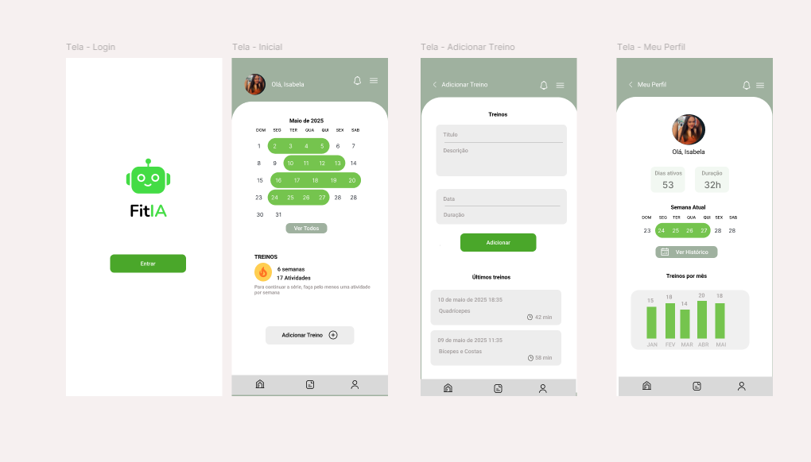

# FitIA App

Aplicativo mobile desenvolvido em **Flutter** com foco em **academias inteligentes**.  
O FitIA utiliza **Inteligência Artificial** para prever cancelamentos de alunos e oferecer insights estratégicos para gestores.

---

## 🚀 Status do Projeto
🔧 Em desenvolvimento – MVP em andamento.  

---

## 📌 Funcionalidades previstas
- 📊 Dashboard para gestores acompanharem métricas de alunos  
- 🤖 Previsão de cancelamento baseada em IA  
- ✅ Registro de frequência dos alunos (com sistema de streaks)  
- 🏋️ Integração com treinos e hábitos  
- 🎮 Gamificação para engajamento  

---

## 🛠️ Tecnologias Utilizadas
- **Flutter** (front-end mobile multiplataforma)  
- **Firebase / Firestore** (autenticação e banco de dados – previsto)  
- **Python + IA** (modelo Random Forest para previsão de evasão)  
- **Streamlit** (dashboard de apoio – versão web)  

---

---

## 🎯 Objetivo
Oferecer uma ferramenta que ajude **gestores de academias** a:
- Reduzir a evasão de alunos  
- Melhorar a retenção por meio de dados e IA  
- Aumentar o engajamento dos alunos com gamificação  

---

## 📌 Próximos Passos
- [ ] Estruturar telas principais no Flutter  
- [ ] Conectar com Firebase  
- [ ] Integrar modelo de IA  
- [ ] Deploy inicial (Android/iOS)  

---

## 📄 Licença
Este projeto está sob a licença MIT. Veja o arquivo [LICENSE](LICENSE) para mais detalhes.

